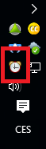
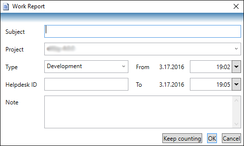
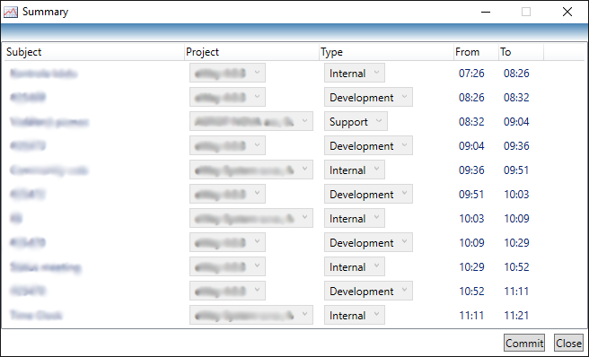

# Time Clock
Time Clock is a Windows application which helps users fill their time sheets in [eWay-CRM](https://www.eway-crm.com/).

It runs in Windows system tray.

Just use your mouse to start or stop counting by clicking the clock icon.

At the end of the day right click the clock icon and select Commit from the menu. Review the records and click OK to upload them into the eWay-CRM database.

[Download Time Clock](http://apps.stefko.cz/TimeClock4/TimeClock.application?classes=btn)